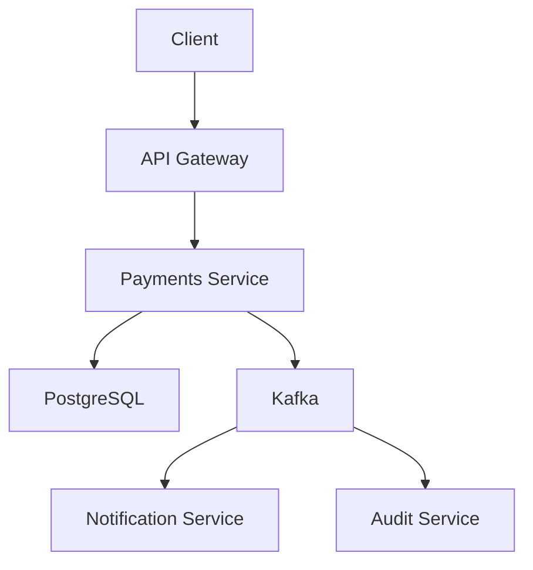

# 🚀 Sugestões de Melhorias para o Payments Service

## 📊 Análise Geral do Projeto

O projeto está bem estruturado como um serviço de pagamentos PIX usando Spring Boot, Kafka e PostgreSQL. No entanto, há várias oportunidades de melhoria para torná-lo mais robusto, escalável e profissional.

---

## 🔧 Melhorias Técnicas

### 1. **Arquitetura e Design Patterns**

#### ✅ Implementar Clean Architecture
```
📁 Estrutura sugerida:
├── domain/           # Entidades de negócio e regras
├── application/      # Casos de uso e serviços de aplicação
├── infrastructure/   # Implementações técnicas (DB, Kafka, HTTP)
└── presentation/     # Controllers e DTOs
```

#### ✅ Separar melhor as responsabilidades
- Criar DTOs específicos para entrada e saída de dados
- Implementar Mappers usando MapStruct
- Separar models de entidade dos DTOs de transferência

### 2. **Qualidade de Código**

#### ✅ Aplicar anotações Lombok corretamente
```java
@Entity
@Table(name = "account_user")
@Data
@NoArgsConstructor
@AllArgsConstructor
@Builder
public class AccountUserModel {
    // Remover getters/setters manuais
}
```

#### ✅ Implementar validações robustas
```java
@NotNull(message = "Nome é obrigatório")
@Size(min = 2, max = 100, message = "Nome deve ter entre 2 e 100 caracteres")
private String userName;

@CPF(message = "CPF inválido")
private String userCpf;

@Email(message = "Email inválido")
private String userEmail;
```

#### ✅ Usar BigDecimal para valores monetários
```java
// Trocar Double por BigDecimal para precisão financeira
@Column(nullable = false, precision = 19, scale = 2)
private BigDecimal userValueBalance;
```

### 3. **Segurança**

#### ✅ Implementar autenticação e autorização
```xml
<dependency>
    <groupId>org.springframework.boot</groupId>
    <artifactId>spring-boot-starter-security</artifactId>
</dependency>
<dependency>
    <groupId>org.springframework.boot</groupId>
    <artifactId>spring-boot-starter-oauth2-resource-server</artifactId>
</dependency>
```

#### ✅ Adicionar rate limiting
```java
@RateLimiter(name = "pixPayment", fallbackMethod = "rateLimitFallback")
@PostMapping("/send")
public ResponseEntity<String> sendPaymentPix(...)
```

#### ✅ Implementar criptografia para dados sensíveis
```java
@Convert(converter = CpfCryptoConverter.class)
private String userCpf;
```

### 4. **Observabilidade e Monitoramento**

#### ✅ Adicionar dependências essenciais
```xml
<!-- Monitoramento -->
<dependency>
    <groupId>org.springframework.boot</groupId>
    <artifactId>spring-boot-starter-actuator</artifactId>
</dependency>

<!-- Métricas -->
<dependency>
    <groupId>io.micrometer</groupId>
    <artifactId>micrometer-registry-prometheus</artifactId>
</dependency>

<!-- Tracing distribuído -->
<dependency>
    <groupId>io.micrometer</groupId>
    <artifactId>micrometer-tracing-bridge-brave</artifactId>
</dependency>
```

#### ✅ Implementar logs estruturados
```java
import net.logstash.logback.encoder.LoggingEventCompositeJsonEncoder;

@Slf4j
@Service
public class PixPaymentService {
    
    public void processPayment(PixPaymentModels payment) {
        log.info("Processing PIX payment: userId={}, amount={}, pixKey={}", 
                payment.getUserSendingId(), 
                payment.getAmount(), 
                payment.getPixKey());
    }
}
```

### 5. **Testes Abrangentes**

#### ✅ Estrutura de testes sugerida
```
src/test/java/
├── unit/          # Testes unitários
├── integration/   # Testes de integração
├── e2e/          # Testes end-to-end
└── contract/     # Testes de contrato (CDC)
```

#### ✅ Implementar testes com cobertura
```xml
<plugin>
    <groupId>org.jacoco</groupId>
    <artifactId>jacoco-maven-plugin</artifactId>
    <version>0.8.8</version>
</plugin>
```

#### ✅ Testes com Testcontainers
```java
@SpringBootTest
@TestPropertySource(properties = {
    "spring.datasource.url=jdbc:tc:postgresql:14:///testdb"
})
class PixPaymentIntegrationTest {
    
    @Container
    static PostgreSQLContainer<?> postgres = new PostgreSQLContainer<>("postgres:14");
    
    @Container
    static KafkaContainer kafka = new KafkaContainer(DockerImageName.parse("confluentinc/cp-kafka:latest"));
}
```

---

## 🗄️ Melhorias de Dados

### 1. **Modelagem de Banco**

#### ✅ Implementar auditoria
```java
@Entity
@EntityListeners(AuditingEntityListener.class)
public class AccountUserModel {
    
    @CreatedDate
    private LocalDateTime createdAt;
    
    @LastModifiedDate
    private LocalDateTime updatedAt;
    
    @CreatedBy
    private String createdBy;
    
    @LastModifiedBy
    private String lastModifiedBy;
}
```

#### ✅ Adicionar índices para performance
```java
@Entity
@Table(name = "account_user", indexes = {
    @Index(name = "idx_user_pix_key", columnList = "userPixKey"),
    @Index(name = "idx_user_cpf", columnList = "userCpf"),
    @Index(name = "idx_user_email", columnList = "userEmail")
})
public class AccountUserModel {
    // ...
}
```

### 2. **Migrations com Flyway**

#### ✅ Adicionar controle de versão do schema
```xml
<dependency>
    <groupId>org.flywaydb</groupId>
    <artifactId>flyway-core</artifactId>
</dependency>
```

```sql
-- V1__Create_account_user_table.sql
CREATE TABLE account_user (
    user_id BIGSERIAL PRIMARY KEY,
    user_name VARCHAR(100) NOT NULL,
    user_email VARCHAR(255) UNIQUE NOT NULL,
    user_cpf VARCHAR(11) UNIQUE NOT NULL,
    -- ...
    created_at TIMESTAMP DEFAULT CURRENT_TIMESTAMP,
    updated_at TIMESTAMP DEFAULT CURRENT_TIMESTAMP
);
```

---

## 🔄 Melhorias de Kafka e Eventos

### 1. **Event Sourcing Pattern**

#### ✅ Implementar eventos de domínio
```java
@Data
@AllArgsConstructor
public class PaymentProcessedEvent {
    private String transactionId;
    private Long senderId;
    private Long receiverId;
    private BigDecimal amount;
    private LocalDateTime processedAt;
    private PaymentStatus status;
}
```

### 2. **Kafka Avro Schemas**

#### ✅ Usar Schema Registry para versionamento
```xml
<dependency>
    <groupId>io.confluent</groupId>
    <artifactId>kafka-avro-serializer</artifactId>
</dependency>
```

### 3. **Dead Letter Queue**

#### ✅ Implementar DLQ para eventos falhos
```java
@KafkaListener(topics = "payment-events")
public void handlePaymentEvent(PaymentEvent event) {
    try {
        processPayment(event);
    } catch (Exception e) {
        log.error("Error processing payment event: {}", event, e);
        kafkaTemplate.send("payment-events-dlq", event);
    }
}
```

---

## 🚀 Melhorias de DevOps e Deploy

### 1. **Dockerfile Otimizado**

```dockerfile
FROM eclipse-temurin:21-jre-alpine AS runtime

RUN addgroup -g 1001 appgroup && \
    adduser -u 1001 -G appgroup -s /bin/sh -D appuser

COPY --chown=appuser:appgroup target/payments-*.jar app.jar

USER appuser

EXPOSE 8080

HEALTHCHECK --interval=30s --timeout=3s --start-period=5s --retries=3 \
  CMD wget --no-verbose --tries=1 --spider http://localhost:8080/actuator/health || exit 1

ENTRYPOINT ["java", "-jar", "/app.jar"]
```

### 2. **CI/CD Pipeline**

#### ✅ GitHub Actions
```yaml
name: CI/CD Pipeline

on:
  push:
    branches: [ main, develop ]
  pull_request:
    branches: [ main ]

jobs:
  test:
    runs-on: ubuntu-latest
    steps:
      - uses: actions/checkout@v3
      - name: Set up JDK 21
        uses: actions/setup-java@v3
        with:
          java-version: '21'
          distribution: 'temurin'
      
      - name: Run tests
        run: ./mvnw clean test
      
      - name: Generate test coverage
        run: ./mvnw jacoco:report
      
      - name: SonarCloud Scan
        uses: SonarSource/sonarcloud-github-action@master
```

### 3. **Docker Compose para Ambientes**

#### ✅ Separar por ambientes
```yaml
# docker-compose.dev.yml
version: '3.8'
services:
  app:
    build: .
    environment:
      - SPRING_PROFILES_ACTIVE=dev
      - SPRING_DATASOURCE_URL=jdbc:postgresql://postgres:5432/pagamentos_dev
    depends_on:
      - postgres
      - kafka
```

---

## 📋 Melhorias de Documentação

### 1. **OpenAPI/Swagger**

#### ✅ Documentação automática da API
```xml
<dependency>
    <groupId>org.springdoc</groupId>
    <artifactId>springdoc-openapi-starter-webmvc-ui</artifactId>
    <version>2.2.0</version>
</dependency>
```

```java
@RestController
@RequestMapping("/payments/pix")
@Tag(name = "PIX Payments", description = "Operações relacionadas a pagamentos PIX")
public class PixPaymentController {
    
    @PostMapping("/send")
    @Operation(summary = "Enviar pagamento PIX", 
               description = "Processa um pagamento PIX entre contas")
    @ApiResponses(value = {
        @ApiResponse(responseCode = "200", description = "Pagamento processado com sucesso"),
        @ApiResponse(responseCode = "400", description = "Dados inválidos"),
        @ApiResponse(responseCode = "404", description = "Conta não encontrada")
    })
    public ResponseEntity<String> sendPaymentPix(@Valid @RequestBody PixPaymentRequest request) {
        // ...
    }
}
```

### 2. **Diagramas de Arquitetura**

#### ✅ Adicionar diagramas com Mermaid
```markdown
## Arquitetura do Sistema



---

## 🔍 Melhorias de Performance

### 1. **Cache Redis**

```xml
<dependency>
    <groupId>org.springframework.boot</groupId>
    <artifactId>spring-boot-starter-data-redis</artifactId>
</dependency>
```

```java
@Cacheable(value = "users", key = "#pixKey")
public AccountUserModel findByPixKey(String pixKey) {
    return userRepository.findByUserPixKey(pixKey);
}
```

### 2. **Connection Pooling**

```yaml
spring:
  datasource:
    hikari:
      maximum-pool-size: 20
      minimum-idle: 5
      connection-timeout: 30000
      idle-timeout: 600000
      max-lifetime: 1800000
```

---

## 📊 Melhorias de Configuração

### 1. **Profiles por Ambiente**

```yaml
# application-dev.yml
spring:
  datasource:
    url: jdbc:postgresql://localhost:5432/pagamentos_dev
  kafka:
    bootstrap-servers: localhost:9092
logging:
  level:
    com.hpg.service.payments: DEBUG

---
# application-prod.yml  
spring:
  datasource:
    url: ${DATABASE_URL}
  kafka:
    bootstrap-servers: ${KAFKA_BROKERS}
logging:
  level:
    com.hpg.service.payments: INFO
```

### 2. **Configuração Externa**

```java
@ConfigurationProperties(prefix = "payments")
@Data
public class PaymentsProperties {
    private BigDecimal maxTransactionAmount = new BigDecimal("5000.00");
    private Integer maxDailyTransactions = 10;
    private Duration transactionTimeout = Duration.ofSeconds(30);
}
```

---

## 🎯 Roadmap de Implementação

### Fase 1 - Fundação (1-2 semanas)
- [ ] Implementar BigDecimal para valores
- [ ] Adicionar validações robustas
- [ ] Configurar Lombok adequadamente
- [ ] Implementar logs estruturados

### Fase 2 - Qualidade (2-3 semanas)
- [ ] Implementar testes unitários e integração
- [ ] Configurar SonarQube/SonarCloud
- [ ] Adicionar tratamento de exceções
- [ ] Implementar auditoria

### Fase 3 - Segurança (1-2 semanas)
- [ ] Implementar autenticação/autorização
- [ ] Adicionar criptografia de dados sensíveis
- [ ] Configurar rate limiting

### Fase 4 - Observabilidade (1-2 semanas)
- [ ] Configurar métricas e monitoramento
- [ ] Implementar health checks
- [ ] Adicionar tracing distribuído

### Fase 5 - DevOps (1-2 semanas)
- [ ] Configurar CI/CD
- [ ] Otimizar Dockerfile
- [ ] Implementar deploy automatizado

---

## 🌟 Considerações Finais

O projeto já tem uma base sólida, mas essas melhorias o tornarão:

- **Mais seguro** com autenticação e criptografia
- **Mais confiável** com testes abrangentes
- **Mais observável** com logs e métricas
- **Mais escalável** com cache e otimizações
- **Mais profissional** com documentação e CI/CD

Recomendo implementar as melhorias em fases, priorizando segurança e qualidade primeiro.